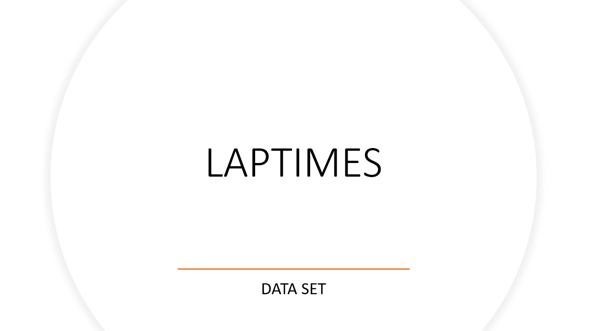

## *RACE* DATA SET

Para la creación del data set de **RACE** en OAC se deben seguir los siguientes pasos: (_Ver video a continuación_)

 

## *LAPTIMES* data set.

Para la creación del data set de **LAPTIMES** en OAC se deben seguir los siguientes pasos: (_Ver video a continuación_)

En este data set encontraremos la información de:

•       La **posición** del piloto en la carrera en ese momento

•       El **tiempo** que ha tardado en completar la vuelta

•       El **tiempo** total que ha tardado en completar todas las vueltas hasta ese momento

•       Si el piloto hizo una **parada en boxes** durante la vuelta

