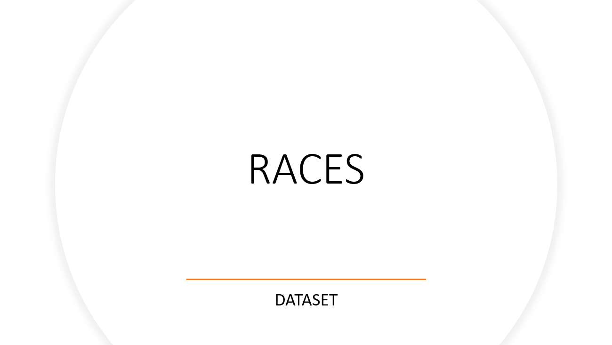

# Bienvenidos a este *hackathon* de Racing 2 Cloud.

## Creación del Dataset de datos-Cargar por OAC.

Lo que primero se va a realizar es la creación de un dataset de datos, para entender como usar la solución de Oracle Analytics Cloud y sus funcionalidades.

[Como Crear un Dataset en OAC](Crear_Dataset_Excel.md)

1- Races

 

