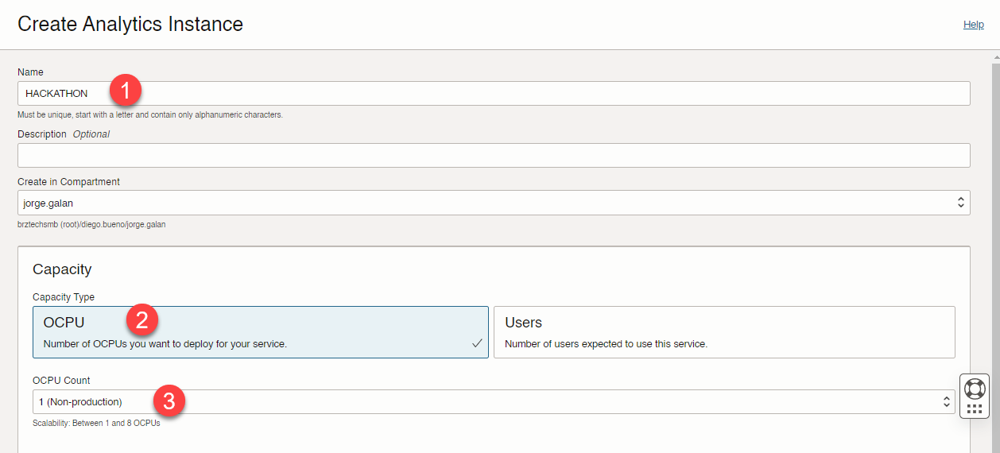

Cara crear una instancia de oracle analytics cloud o **OAC**, se deben seguir los siguientes pasos:

Ingresar al menú general -> Analytics & AI -> Analytics -> Analytics Cloud


Seleccionar crear instancia


Crear la instancia de Analytics con los parámetros mostrados en la imagen y selecciono crear.

NAME
```
HACKATHON
```




[VOLVER](README.md)

